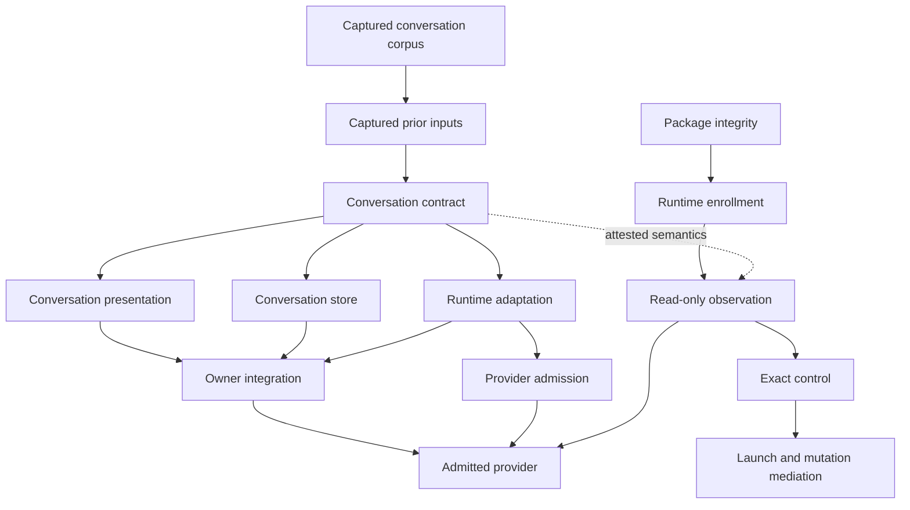

# Catalyst host integration contract

> **Owner:** Catalyst host integration tests and documentation
> **Authority:** none
> **Production mutation:** none
> **Disposition:** static contract green; live enrollment and launch/mutation remain held

## Purpose

This contract keeps generic host behavior provider-neutral and separates observation, control,
persistence, runtime execution, and mutation authority. It imports content-addressed contracts from
their repository owners; it does not create a second runtime, store, or authority model.

## Ownership boundaries

| Contract | Owner | Responsibility |
|---|---|---|
| conversation contract | Butler conversation core | canonical event admission, reduction, and typed unavailable capabilities |
| conversation presentation | UGUI | presentation-only semantic projection and accessibility |
| conversation store | Store | durable idempotent append, recovery, retention, and private/control partitioning |
| runtime adaptation | Butler runtime | provider events translated into admitted conversation events |
| runtime enrollment | Butler enrollment | verified runtime binding, read-only observation, and exact control |
| provider admission | Butler provider | bounded provider behavior and fault semantics |
| owner integration | RUN | deterministic composition of runtime, Store, and UGUI owners |
| admitted provider | RUN | one provider cell admitted through enrollment, Plexus, accounting, and privacy gates |
| visible host binding | Catalyst | observe-only host projection with no private runtime authority |

## Dependency graph

An arrow means the target cannot claim readiness before the source contract closes.

The host enrollment path is parallel to conversation presentation, storage, and runtime adaptation.
It consumes the conversation contract only as an attested semantic boundary. It does not own private
conversation history, provider internals, or acceptance authority.

## Invariants

1. Generic host names, methods, results, and annotations contain no provider, thread, turn, or process identity.
2. `resume_after_restart`, `durable_replay`, `external_control`, and `durable_close_proof` remain literal false unless separately implemented and attested.
3. Observe-only bindings reject send, steer, interrupt, branch, compress, delete, archive, approve, and authority upgrade before constructing an agent or causing an effect.
4. Background events may update cache and status only; they never open, navigate, select, or focus UI.
5. The first live canary is read-only. It requires package integrity, enrollment, exact binding, bounded content-free events, and exact close evidence.
6. Exact control follows read-only observation and refuses stale, foreign, and terminal targets.
7. Launch and mutation remain disabled until descriptor-relative below-shell lease mediation and independent QUINE acceptance exist.
8. No endpoint, route, MCP metadata, key persistence, runtime lookup, provider identity, or dispatch is inferred from this static contract.

## Current owner anchors

- `butler/conversation-core/CONVERSATION-CONTRACT-RECEIPT.json`
- `butler/receipts/CATALYST-RUNTIME-PROVISIONAL-RECEIPT.json`
- `store/tests/fixtures/conversation/CONVERSATION-STORE-PROVISIONAL-RECEIPT.json`
- `run/receipts/CATALYST-ENROLLMENT-PROVISIONAL-RECEIPT.json`
- `butler/src/catalyst_provider/PROVIDER-PROVISIONAL-RECEIPT.json`
- `run/receipts/CATALYST-INTEGRATION-PROVISIONAL-RECEIPT.json`
- `run/receipts/CATALYST-ADMITTED-PROVIDER-RECEIPT.json`

## Acceptance sequence

1. Verify the closed execution-host parser and keyed signature contract without endpoints or runtime imports.
2. Close package integrity and enrollment independently; an unkeyed challenge digest is not proof of possession.
3. Persist one typed opaque observe-only binding in the existing SessionDB owner.
4. Enforce observe-only rejection before agent construction or effect.
5. Run the bounded read-only canary and verify exact close.
6. Run exact steer and interrupt controls and verify stale, foreign, and terminal refusal.
7. Keep launch and mutation held until lease mediation and QUINE acceptance are independently green.

## Falsifiers

- generic host APIs expose provider or private runtime identity
- an unavailable capability is emulated under a broader generic verb
- observation causes foreground navigation or mutation
- enrollment, control, or mutation is inferred from source labels or topology
- one owner reads or rewrites another owner's private state
- a provisional receipt is treated as acceptance authority
